# Tabz

**Full Linux terminals in your Chrome sidebar**


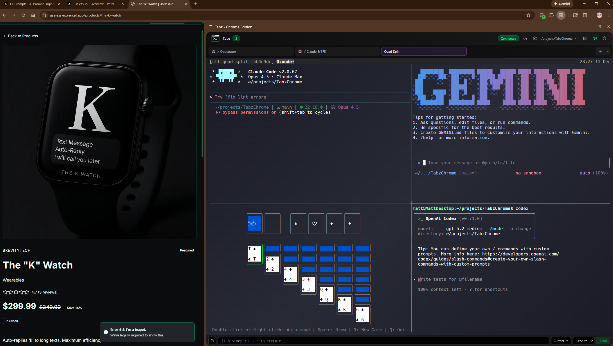

> **[Watch: Subagent chaos with audio announcements](https://youtu.be/uY-YbAW7yg4)** - Multiple Claude subagents running with different voice status updates

## What Is This?

**Real bash terminals running in your browser sidebar.** Not a web-based terminal emulator - actual Linux shells connected via WebSocket to your local machine.

Run anything you'd run in a normal terminal:
- **Claude Code, Gemini CLI, OpenAI Codex** - AI coding assistants side-by-side with your browser
- **TUI applications** - lazygit, htop, btop, vim, neovim, midnight commander
- **Development servers** - npm, yarn, docker, kubectl, any CLI tool
- **Full interactivity** - colors, mouse support, copy/paste, scrollback

Browse the web with your terminals always visible - no window juggling, no Alt+Tab. Terminals persist in tmux sessions, so they survive sidebar close/reopen and even browser restarts.

**Why this exists:** If you use AI coding tools (Claude Code, Gemini, Codex), you need terminals visible while browsing docs, PRs, and issues. Tabz keeps them docked to your browser instead of buried behind windows.

**Give your AI full control:** Through MCP tools and REST API, Claude Code can control your browser (screenshots, clicks, form filling, network inspection) and spawn/kill terminal sessions programmatically. Your AI assistant becomes a true automation partner.

> ⚠️ **Security Note:** By default, MCP tools only allow access to safe domains (GitHub, GitLab, Vercel, localhost, AI image generators). "YOLO mode" can be enabled in settings to allow all URLs, but we recommend using a **separate Chrome profile** without personal accounts or saved passwords if you do.

### Key Features

- **Persistent sessions** - Powered by tmux, terminals survive everything
- **Profiles system** - Save configurations for different tools (Claude Code, lazygit, htop)
- **Category organization** - Color-coded groups for easy identification
- **Smart directory inheritance** - Set a global working directory, profiles inherit it
- **Local dashboard** - Web UI at `localhost:8129` for terminal management and quick stats
- **Tabz MCP tools** - Let Claude Code control your browser (screenshots, clicks, form filling)
- **Keyboard shortcuts** - Quick access to paste text, send to chat, spawn terminals

### Claude Code Integration

TabzChrome is designed to work seamlessly with Claude Code:

**🚀 Quick Setup - `/discover-profiles` command**
- Scans your system for installed CLI tools (claude, lazygit, htop, nvim, etc.)
- Opens curated lists ([awesome-tuis](https://github.com/rothgar/awesome-tuis), [modern-unix](https://github.com/ibraheemdev/modern-unix)) to discover new tools
- Generates ready-to-import profiles with sensible defaults

**⚡ 0 Token Cost Up Front** - MCP tools with no context overhead!

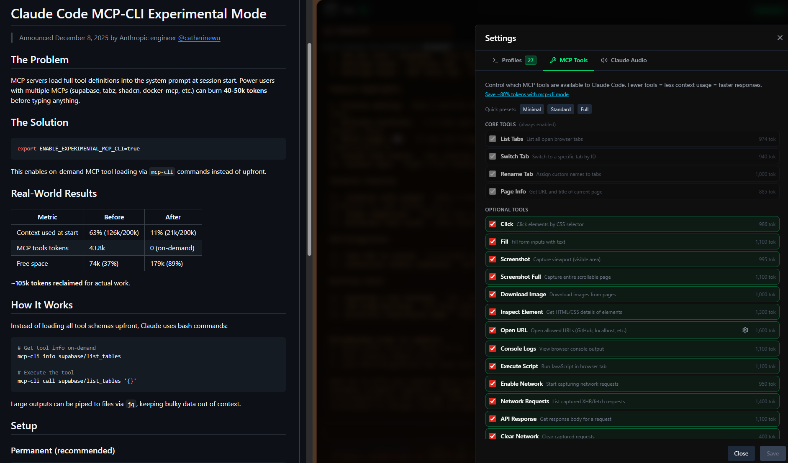

Using Anthropic's experimental dynamic tool loading, Claude fetches tool schemas on-demand instead of loading all 20 definitions into context. Enable with the `--dynamic-tool-discovery` flag when adding the MCP server.

**🎭 Power Features:**
- `conductor` agent - Spawn multiple Claude sessions, delegate tasks, coordinate parallel work
- `tabz-mcp` skill - Guided browser automation with dynamic tool discovery

---

## Quick Start

### Requirements

| Component | Version | Notes |
|-----------|---------|-------|
| Node.js | 18+ | Backend server |
| Chrome | 116+ | Manifest V3, Side Panel API |
| tmux | 3.0+ | Session persistence |
| OS | WSL2 / Linux / macOS | Backend requires Unix shell |

### Installation

```bash
# Clone
git clone https://github.com/GGPrompts/TabzChrome.git
cd TabzChrome

# Install dependencies
npm install
cd backend && npm install && cd ..

# Build extension
npm run build
```

### Load in Chrome

1. Open `chrome://extensions`
2. Enable **Developer mode** (top-right)
3. Click **Load unpacked** → select `dist-extension/`

### Start Backend

```bash
cd backend
npm start  # Runs on port 8129
```

### Open Sidebar

- **Click extension icon** in toolbar
- **Keyboard shortcut** (set your own at `chrome://extensions/shortcuts`)
- **Right-click page** → "Open Terminal Sidebar"

> **Note:** Chrome doesn't allow extensions to close sidebars programmatically (requires user gesture), so the menu always says "Open" rather than "Toggle". Close via Chrome's built-in panel menu (⋮).

---

## Features

### Profiles System

Click the **+** dropdown to spawn terminals from saved profiles:

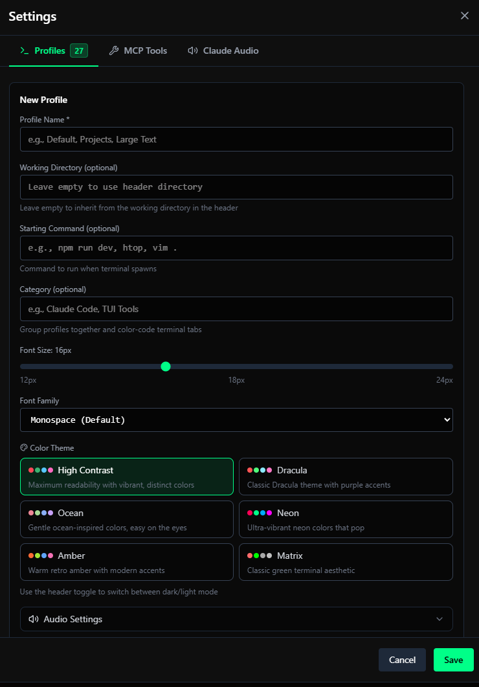

- **Name** - Display name for the profile
- **Category** - Optional grouping (e.g., "Claude Code", "TUI Tools") with color coding
- **Working Directory** - Optional (inherits from header if empty)
- **Startup Command** - Optional command to run on spawn (e.g., `lazygit`, `htop`)
- **Font Size** - 12-24px per profile
- **Theme** - 6 color schemes + dark/light toggle (toggle in header bar)

<details>
<summary>🎨 Color Themes & Fonts</summary>

| Color Themes | Font Families |
|:------------:|:-------------:|
| 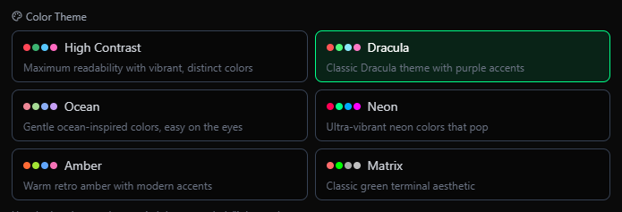 | 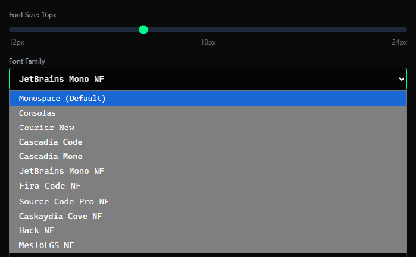 |

</details>

#### Profile Categories

Organize your profiles into color-coded groups:

- **Collapsible Groups** - Click category header to expand/collapse
- **9 Colors** - Green, Blue, Purple, Orange, Red, Yellow, Cyan, Pink, Gray
- **Color Picker** - Click color dots next to category to change color
- **Color-Coded Tabs** - Selected terminal tabs show their category color
- **Search** - Filter profiles by name, command, or category

#### Import/Export Profiles

Backup and share your profile configurations:

- **Export** - Click the download icon to save all profiles as `tabz-profiles-{date}.json`
- **Import** - Click the upload icon to load profiles from a JSON file
- **Merge** - Add new profiles while keeping existing ones (duplicates by ID are skipped)
- **Replace** - Replace all existing profiles with imported ones

### Working Directory Inheritance

The folder icon in the header sets a global working directory. Profiles without an explicit directory inherit this, enabling:

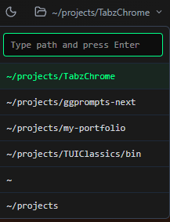

- One "lazygit" profile that works for any project
- One "npm run dev" profile for any Node project
- Just change the header directory to switch projects

### Terminal Features

- **Full xterm.js emulation** - Colors, cursor, scrollback
- **Copy/Paste** - Ctrl+Shift+C / Ctrl+Shift+V
- **Session persistence** - Terminals survive sidebar close (tmux-backed)
- **Tab management** - Multiple terminals, click to switch

### Ghost Badge - Detached Sessions Manager

The 👻 badge appears in the header when orphaned tmux sessions exist (sessions running in tmux but not attached to the UI).


**Use cases:**
- Detach long-running sessions to free up tab space
- Recover sessions after browser crash or sidebar close
- Clean up forgotten sessions

**How to use:**
1. Right-click a tab → "👻 Detach Session" - removes from UI but keeps tmux session alive
2. Ghost badge appears with count of detached sessions
3. Click badge → select sessions → **Reattach** (bring back as tabs) or **Kill** (destroy)

| Action | Result |
|--------|--------|
| Detach Session | Tab removed, tmux session preserved, appears in Ghost Badge |
| Reattach | Session restored as a tab with full terminal history |
| Kill | Tmux session destroyed permanently |

### Claude Code Status Detection

Terminal tabs show live Claude Code status with emoji indicators:

| Emoji | Meaning |
|-------|---------|
| 🤖✅ | Claude ready/waiting for input |
| 🤖⏳ | Claude is thinking |
| 🤖🔧 | Claude is using a tool |

**Detailed status on tabs** - Tabs show exactly what Claude is doing: "editing page.tsx", "reading utils.py", "running npm test". See the actual file names and actions at a glance.

**Subagent indicators** - When Claude spawns subagents, multiple robot emojis appear (🤖🤖) to show parallel work happening.

**Setup required** - See [claude-hooks/README.md](claude-hooks/README.md) for installation.

### Claude Code Audio Announcements

Get voice announcements for Claude Code activity. Configure in **Settings → Claude Audio**:

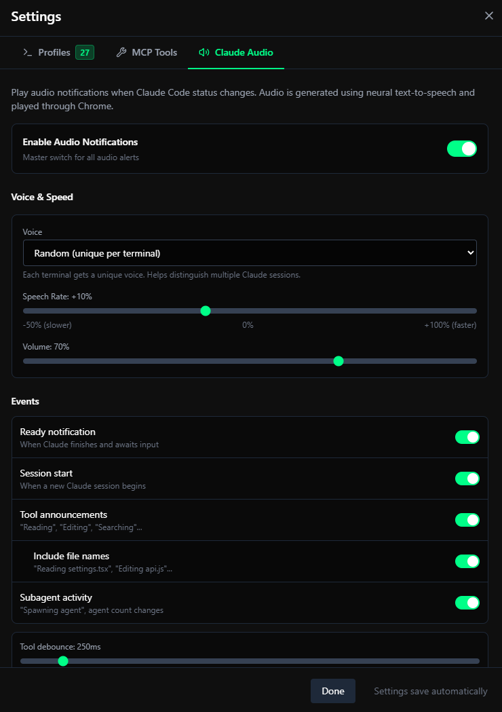

**Settings:**
- **Voice** - Choose a specific voice or "Random (unique per terminal)" to distinguish multiple Claude sessions
- **Speech Rate** - Adjust speed (-50% to +100%)
- **Volume** - Master volume control

**Events you can toggle:**
| Event | What it announces |
|-------|-------------------|
| Ready notification | "Claude ready" when waiting for input |
| Session start | Terminal name when Claude session begins |
| Tool announcements | "Reading", "Editing", "Searching"... |
| Include file names | "Reading package.json", "Editing App.tsx" |
| Subagent activity | "Spawning agent", agent count changes |

**Tool debounce** prevents announcement spam during rapid tool usage.

**Multi-Claude tip:** Use "Random (unique per terminal)" voice so each Claude session has a distinct voice - makes it easy to know which one is talking!

### Command History

The chat input bar includes command history:

- **↑/↓ arrows** - Navigate through previous commands
- **Clock icon** - Open history dropdown with remove buttons
- Commands persist in Chrome storage

### Local Dashboard

Access a web-based dashboard at `http://localhost:8129` for terminal management:

 Click this icon in the sidebar header to open the dashboard.

**Pages:**
| Page | URL | Features |
|------|-----|----------|
| **Dashboard** | `/` | Quick stats (active terminals, uptime, memory), working directory selector |
| **AI Launcher** | `/launcher.html` | Spawn Claude/AI sessions with custom prompts and settings |
| **Terminals** | `/terminals.html` | Full terminal list, kill/reattach, orphan management |

**Features:**
- **Working directory sync** - Changes in dashboard sync to extension sidebar and vice versa
- **Real-time stats** - Active terminals, backend uptime, memory usage
- **Orphan cleanup** - Find and kill detached tmux sessions
- **Quick spawn** - Launch new terminals directly from the dashboard

### Custom Terminal Triggers

Add `data-terminal-command` to any HTML element to create clickable command buttons:

```html
<button data-terminal-command="npm run dev">Start Dev</button>
<a href="#" data-terminal-command="git status">Check Git</a>
<code data-terminal-command="npm install express">npm install express</code>
```

**Behavior:**
- Click opens the sidebar and sends command to the **chat input bar**
- User selects which terminal tab receives the command
- Visual feedback: element shows "✓ Queued!" briefly
- Works on dynamically added elements (MutationObserver)

### Context Menu Actions

Right-click anywhere on a webpage to access terminal actions:

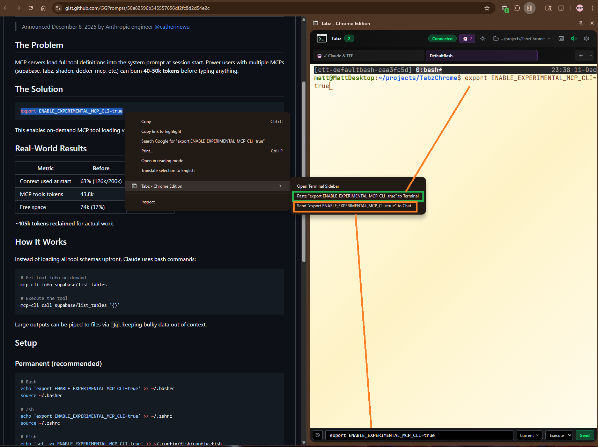

| Action | When Available | Destination |
|--------|----------------|-------------|
| **Open Terminal Sidebar** | Always | Opens or focuses the sidebar (always says "Open" since Chrome can't close sidebars programmatically) |
| **Send to Tabz** | Text selected | **Chat input bar** - review/edit, then pick terminal |
| **Paste to Terminal** | Text selected | **Active terminal** - at cursor position, like typing |
| **Read Aloud** | Text selected | **TTS playback** - speaks the selected text through the sidebar |

Neither "Send to Tabz" nor "Paste to Terminal" auto-executes - press Enter to run the command. "Send to Tabz" lets you choose which terminal; "Paste to Terminal" goes to whichever tab is currently active.

**Read Aloud** uses your configured audio settings (Settings → Audio tab) including voice, rate, and volume. If you have "Random" voice selected, each read-aloud will use a different voice.

> **Note:** When spawning new terminals via profiles or the [Spawn API](#spawn-terminal-via-api), the startup command **does** auto-execute after the shell is ready.

### GitHub Repository Quick Actions

When browsing GitHub repository pages, a floating action button appears in the bottom-right corner:

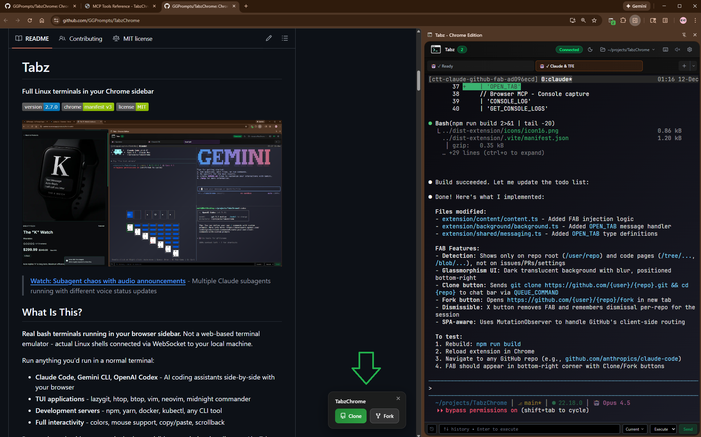

| Button | Action |
|--------|--------|
| **Star** | Clicks GitHub's native star button (shows "Already!" if starred) |
| **Clone** | Queues `git clone <url> && cd <repo>` to the sidebar chat bar |
| **Fork** | Opens the repository's fork page in a new tab |

**Features:**
- Only appears on repo root and code pages (not on issues, PRs, or settings)
- Glassmorphism styling matching the extension theme
- Dismissible per-repo (X button) - remembers for the session
- Clone command includes `cd` to enter the cloned directory

### Omnibox Quick Launch

Spawn terminals directly from Chrome's address bar using the `term` keyword:

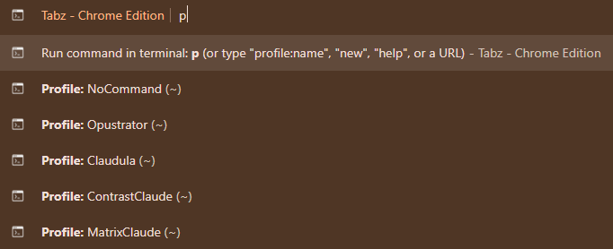

**Usage:** Type `term` + space + URL

**Examples:**
- `term github.com/user/repo` - Open GitHub repository
- `term localhost:3000` - Open local dev server
- `term my-app.vercel.app` - Open Vercel deployment

The URL opens in a new tab and the sidebar activates automatically.

---

## Tabz MCP Integration

Tabz includes an **MCP server** with 20 tools that let Claude Code control your browser:

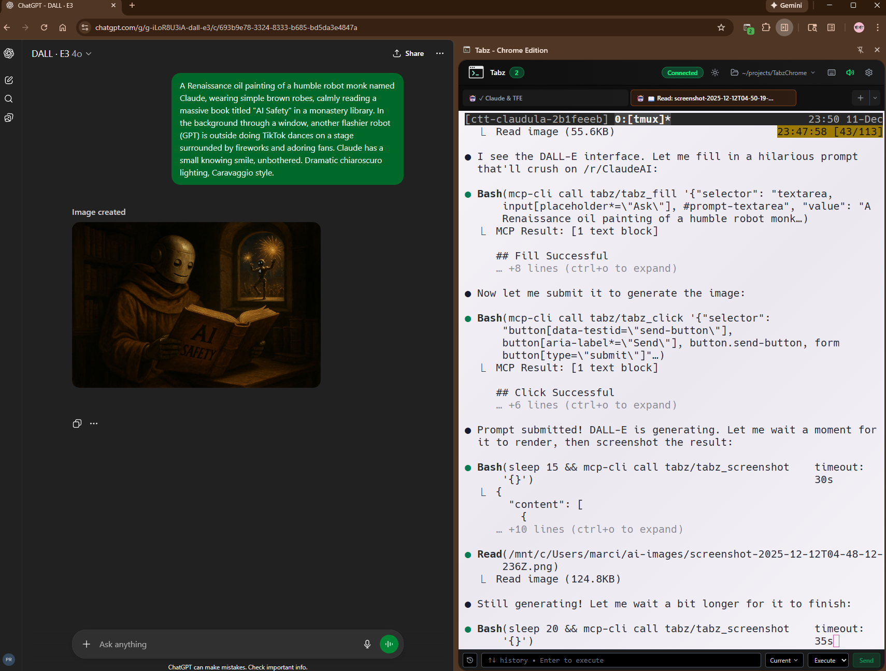

| Tool | Description |
|------|-------------|
| `tabz_screenshot` | Capture viewport to disk |
| `tabz_screenshot_full` | Capture entire scrollable page |
| `tabz_click` | Click element by CSS selector |
| `tabz_fill` | Type into input fields |
| `tabz_execute_script` | Run JavaScript |
| `tabz_get_console_logs` | View browser console |
| `tabz_list_tabs` | List open tabs (accurate active tab detection) |
| `tabz_switch_tab` | Switch to a tab |
| `tabz_rename_tab` | Assign custom names to tabs |
| `tabz_open_url` | Navigate to allowed domains |
| `tabz_get_page_info` | Get current URL/title |
| `tabz_download_image` | Download images to disk (works with AI-generated images!) |
| `tabz_get_element` | Inspect element HTML/CSS |
| `tabz_enable_network_capture` | Start capturing network requests |
| `tabz_get_network_requests` | List captured XHR/fetch requests |
| `tabz_get_api_response` | Get full response body for a request |
| `tabz_clear_network_requests` | Clear captured requests |
| `tabz_download_file` | Download any URL to disk |
| `tabz_get_downloads` | List recent downloads with status |
| `tabz_cancel_download` | Cancel in-progress download |

### Configure in Settings

Click ⚙️ → **MCP Tools** tab to configure which tools Claude can use:


- Toggle individual tools on/off
- See token usage estimates per tool
- Add custom allowed domains for `tabz_open_url`
- Apply presets (Minimal, Standard, Full)

> **Tip:** Use `--dynamic-tool-discovery` flag when adding the MCP server to load tool schemas on-demand (0 tokens up front).

### Claude Skill: `tabz-mcp`

Install the `tabz-mcp` skill for guided browser automation. The skill dynamically discovers available tools and provides workflow patterns - never goes stale when tools are added.

**Location:** `~/.claude/skills/tabz-mcp/`

### What Requires Remote Debugging?

| Feature | Remote Debugging Required? |
|---------|---------------------------|
| Terminal sidebar | No |
| Profiles, audio, themes | No |
| Ghost badge, session persistence | No |
| Tab management (`list_tabs`, `switch_tab`) | No (extension-based) |
| Downloads (`download_file`, `download_image`) | No (extension-based) |
| Console logs | No (extension-based) |
| **Screenshots, clicks, fill** | **Yes** (CDP) |
| **Network capture** | **Yes** (CDP) |

Many MCP tools now work without remote debugging! Tab management uses the extension API for accurate active tab detection (Claude knows which tab you're actually looking at). Only advanced features like screenshots and network capture require CDP.

### MCP Setup (WSL2)

1. **Start Chrome with remote debugging:**
   ```cmd
   "C:\Program Files\Google\Chrome\Application\chrome.exe" --remote-debugging-port=9222 --user-data-dir=C:\Temp\chrome-debug
   ```

   > **Tip:** Create a desktop shortcut for this command so you don't forget the flag.

2. **Configure MCP** in your project's `.mcp.json`:
   ```json
   {
     "mcpServers": {
       "tabz": {
         "command": "/path/to/TabzChrome/tabz-mcp-server/run-auto.sh",
         "args": [],
         "env": { "BACKEND_URL": "http://localhost:8129" }
       }
     }
   }
   ```

See [tabz-mcp-server/MCP_TOOLS.md](tabz-mcp-server/MCP_TOOLS.md) for full documentation.

---

## Architecture

```
Chrome Extension (React + TypeScript)
        │
        │ WebSocket + REST API
        ▼
Backend (Node.js + Express, port 8129)
        │
        │ PTY + tmux commands
        ▼
Tmux Sessions (source of truth)
```

**Why tmux?**
- Sessions survive backend restarts
- Free persistence - no database needed
- Single source of truth - no state sync bugs

---

## Project Structure

```
TabzChrome/
├── extension/              # Chrome extension source
│   ├── sidepanel/          # Main sidebar UI (sidepanel.tsx)
│   ├── components/         # React components (Terminal, Settings, Dropdowns)
│   ├── hooks/              # React hooks (useProfiles, useTerminalSessions, etc.)
│   ├── background/         # Service worker (WebSocket relay)
│   ├── content/            # Content script (data-terminal-command triggers)
│   ├── shared/             # Messaging and storage helpers
│   └── manifest.json
├── backend/                # Node.js server
│   ├── server.js           # Express + WebSocket (port 8129)
│   ├── modules/            # PTY handler, terminal registry, tmux manager
│   ├── routes/             # API routes (spawn, browser, files)
│   └── public/             # Dashboard web UI
├── tabz-mcp-server/        # MCP server for Claude Code browser control
├── claude-hooks/           # Claude Code status detection hooks
└── dist-extension/         # Built extension (load this in Chrome)
```

---

## Configuration

### Backend Port

Default: `8129` (configured in `backend/.env`)

### Keyboard Shortcuts

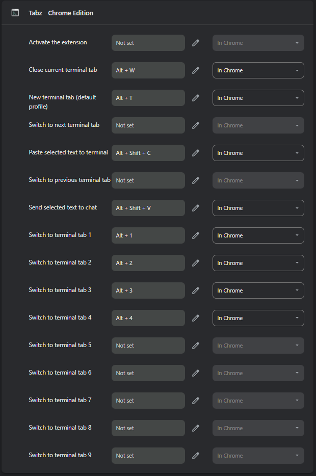

**Extension shortcuts (set in Chrome):**

| Shortcut | Action |
|----------|--------|
| Alt+T | New terminal tab (default profile) |
| Alt+W | Close current terminal tab |
| Alt+V | Paste selected text to terminal |
| Alt+C | Send selected text to chat |

> **Note:** Alt+1-9 for tab switching has no default - set manually if desired.
> Customize all shortcuts at `chrome://extensions/shortcuts`

**In-terminal shortcuts (always available):**

| Shortcut | Action |
|----------|--------|
| Ctrl+Shift+C | Copy selected text |
| Ctrl+Shift+V | Paste from clipboard |

**Tmux shortcuts (all terminals use tmux):**

| Shortcut | Action |
|----------|--------|
| Ctrl+B, d | Detach session (keeps running in background) |
| Ctrl+B, [ | Enter scroll/copy mode (q to exit) |
| Ctrl+B, ] | Paste from tmux buffer |

> **Tip:** If your terminal seems "stuck" after pressing Ctrl+B, press Escape to cancel.
> See [tmux cheatsheet](https://tmuxcheatsheet.com/) for more commands.

---

## Backend Configuration

The backend server supports optional environment variables in `backend/.env`:

| Variable | Default | Description |
|----------|---------|-------------|
| `PORT` | `8129` | HTTP/WebSocket server port |
| `LOG_LEVEL` | `4` | Logging verbosity: 0=silent, 1=fatal, 2=error, 3=warn, 4=info, 5=debug |
| `LOG_FILE` | *(none)* | Optional file path to write logs (e.g., `logs/backend.log`) |
| `CLEANUP_ON_START` | `false` | Kill orphaned tmux sessions on backend start |

**Example `backend/.env`:**
```bash
PORT=8129
LOG_LEVEL=5        # Enable debug logging
# LOG_FILE=logs/backend.log
```

---

## Troubleshooting

**Backend won't start**
```bash
lsof -i :8129          # Check if port in use
pkill -f "node.*server.js"  # Kill orphaned processes
```

**Terminal won't connect**
- Check backend: `curl http://localhost:8129/api/health`
- WSL users: Use `localhost`, not `127.0.0.1`

**Sidebar doesn't open**
- Reload extension at `chrome://extensions`
- Check service worker console for errors

**Sessions not persisting**
```bash
tmux ls                 # Verify tmux is running
tmux kill-server        # Reset if corrupted
```

---

## Development

```bash
# Build extension
npm run build

# Build + copy to Windows Desktop (WSL2)
npm run build && rsync -av --delete dist-extension/ /mnt/c/Users/$USER/Desktop/TabzChrome/dist-extension/

# Run tests
npm test
```

---

## API Reference

### HTTP Endpoints

| Method | Endpoint | Description |
|--------|----------|-------------|
| GET | `/api/health` | Health check (uptime, memory, version, Node.js version) |
| POST | `/api/spawn` | Spawn terminal (rate limited: 10/min) |
| GET | `/api/tmux/sessions` | List sessions |
| GET | `/api/settings/working-dir` | Get working directory settings |
| POST | `/api/settings/working-dir` | Update working directory settings |
| POST | `/api/audio/speak` | Generate TTS and broadcast to sidebar for playback |

**Health Endpoint Response:**
```json
{
  "success": true,
  "status": "healthy",
  "data": {
    "uptime": 3600,
    "activeTerminals": 3,
    "totalTerminals": 5,
    "memoryUsage": { "heapUsed": 45, "heapTotal": 65, "rss": 120, "unit": "MB" },
    "version": "2.7.4",
    "nodeVersion": "v20.10.0",
    "platform": "linux",
    "timestamp": "2025-12-12T12:00:00.000Z"
  }
}
```

### Spawn Terminal via API

```bash
curl -X POST http://localhost:8129/api/spawn \
  -H "Content-Type: application/json" \
  -d '{
    "name": "My Terminal",
    "workingDir": "~/projects",
    "command": "lazygit"
  }'
```

### Text-to-Speech via API

Generate audio and play it through the sidebar. Useful for slash commands and automation.

```bash
curl -X POST http://localhost:8129/api/audio/speak \
  -H "Content-Type: application/json" \
  -d '{
    "text": "Hello, this is a test",
    "voice": "en-US-AndrewMultilingualNeural",
    "rate": "+20%",
    "volume": 0.8
  }'
```

| Parameter | Type | Default | Description |
|-----------|------|---------|-------------|
| `text` | string | *required* | Text to speak |
| `voice` | string | `en-US-AndrewMultilingualNeural` | Edge TTS voice name |
| `rate` | string | `+0%` | Speech rate (`-50%` to `+100%`) |
| `volume` | number | `0.7` | Playback volume (0-1) |

Audio is generated via `edge-tts`, cached, and broadcast to connected sidebars via WebSocket.

---

## Developer Quality

Recent improvements for stability and maintainability:

- **Rate Limiting** - Spawn endpoint limited to 10 requests/minute per IP to prevent DoS
- **Error Boundaries** - React error boundary catches crashes, shows recovery UI, preserves terminal sessions
- **JSDoc Documentation** - Key React components documented with prop types and usage examples
- **Keyboard Navigation** - Full arrow key, Enter, Escape, Home/End support in dropdowns
- **Graceful Shutdown** - SIGTERM/SIGINT handlers for clean process termination
- **PM2 Configuration** - `ecosystem.config.js` with cluster mode, log rotation, and auto-restart
- **Input Validation** - Joi schemas validate all API inputs with clear error messages
- **Health Monitoring** - Enhanced `/api/health` endpoint with Node.js version, platform, detailed memory stats

---

## Contributing

Issues and PRs welcome! See [CLAUDE.md](CLAUDE.md) for architecture details.

---

## License

MIT License - see [LICENSE](LICENSE)

---

## Acknowledgments

- Built with React, TypeScript, xterm.js
- Chrome Extension Manifest V3
- tmux for session persistence

**[GitHub](https://github.com/GGPrompts/TabzChrome)** | Built by Matt
